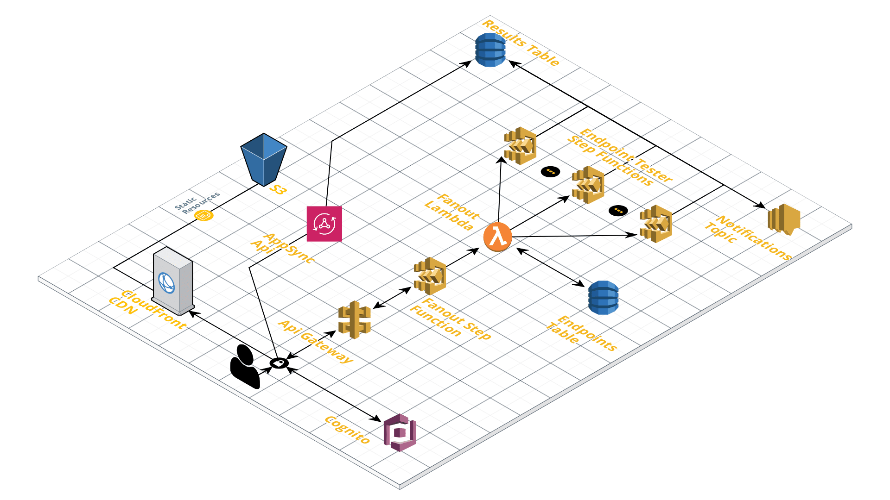

# Serverless Monitoring App

[](https://opensource.org/licenses/MIT)

## Architecture



## Prerequisites

[Nodejs](https://nodejs.org/en/) (at least version 8)

[Yarn](https://yarnpkg.com/lang/en/)

Amazon AWS account and `awscli` installed and configured: <https://aws.amazon.com/getting-started/>

Serverless [CLI](https://serverless.com/framework/docs/getting-started/)

## Repository structure

This repository uses [lerna](https://lernajs.io/) and yarn workspaces to handle dependencies.

The React frontend app sits under `frontend/`.

"Back-end" services sit under `services/`.

Typescript is used across the repository.

## Setup

Install Dependencies

```bash
yarn install
```

Setup environment file

```bash
export STAGE=dev
export region_dev=us-east-1
export admin_email_dev=your@email.address
node cicd/setupEnvFile.js
```

## Deploy

Deploy all services and frontend

```bash
yarn run:all:dev
```

## Run Tests

```bash
yarn test
```

```bash
yarn coverage
```

## Cleanup

Removes all services and frontend

```bash
yarn remove:all:dev
```
